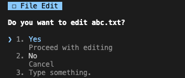
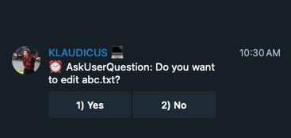
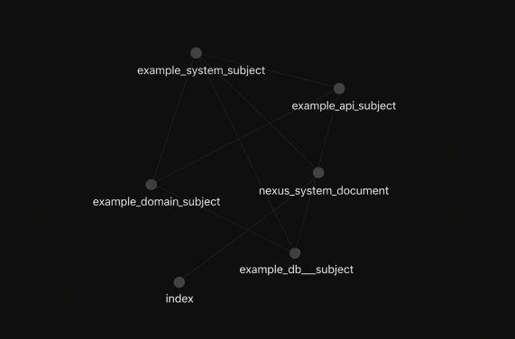

# Nexus

Claude Code Task Management Template

---

## Key Features

- **Regular Task Management**: `~!` start → `~@` complete → `~#` test
- **Automatic History Recording**: Track work in YAML format
- **6 Specialized Agents**: @analyst, @coder, @tester, @reviewer, @deployer, @librarian
- **Telegram Remote Control**: Approve permissions and execute commands even when away
- **Commands**: `/boot`, `/commit`, `/fetch`

---

# Usage

## Workflow

```
/boot                     # 1. Boot project
~! Add new feature        # 2. Start task
... work in progress ...  # 3. Coding
~@                        # 4. Complete (update docs + commit)
```

---

## Regular Tasks

### Start Task: `~!`

```
~! Task description
```

| Action | Description |
|--------|-------------|
| Generate task ID | `author_YYYYMMDDHHMMSS_xxx` format |
| Create file | `.nexus/history/taskid.yaml` |
| @librarian call | Search related knowledge docs |
| TODO list | Auto-generated |

### Complete Task: `~@`

```
~@
```

| Action | Description |
|--------|-------------|
| Update tasks | `[x]` completed / `[~]` cancelled |
| @librarian call | Update knowledge docs |
| @deployer call | Commit & push |

### Run Tests: `~#`

```
~#
```

| Action | Description |
|--------|-------------|
| @tester call | Playwright MCP automated tests |
| Create record | `.nexus/test/T*.yaml` |

---

## Commands

| Command | Description |
|---------|-------------|
| `/boot` | Load project settings and history |
| `/commit` | Commit & push current changes |
| `/fetch` | Pull remote source + update knowledge docs |
| `/output-style buffer-style` | Standardize response format (INFO/QUESTION/ERROR) |

---

## Agents

6 specialized agents are called automatically.

| Agent | Role |
|-------|------|
| @analyst | Requirements analysis, impact assessment |
| @coder | Write and modify code |
| @tester | Playwright automated testing |
| @reviewer | Code review, quality check |
| @deployer | Write commit messages, deploy |
| @librarian | Manage knowledge docs (.nexus/note) |

Agent files: `.claude/agents/*.md`

---

## Telegram Remote Control

Control Claude Code from Telegram even when away from PC.

<p align="center">
  
  
</p>

### Commands

| Command | Action |
|---------|--------|
| `/yes`, `/1` | Select Yes |
| `/allow`, `/2` | Select Allow for session |
| `/no`, `/3` | Select No |
| `/claude <message>` | Direct input to Claude |
| `/tail` | View current screen (last 2000 chars) |
| `/status` | Check tmux session status |

### Pending Notifications

Telegram notifications are sent **only during regular tasks (`~!` ~ `~@`)**.

Notification after 30 seconds of tool permission wait:
```
~! start task → Permission request → 30s wait → Telegram notification → /yes click → proceed
```

No notifications are sent during regular conversations (outside regular tasks).

### tmux Session Management

```bash
Ctrl+B, D              # Detach (keep in background)
tmux attach -t claude  # Reattach
tmux kill-session -t claude  # Terminate
```

---

# Installation & Setup

## 1. Copy Template

```bash
cp -r .claude /path/to/new-project/
cp -r .nexus /path/to/new-project/
cd /path/to/new-project
```

## 2. Required Settings

Edit `.nexus/settings/nexus.properties`:

```properties
# Required
project.name=ProjectName
project.author=username              # Alphanumeric, max 20 chars

# Optional: Global rules
global.strict.rule.1=Respond in English
global.strict.rule.2=Ask if uncertain
```

Initialize history:
```bash
rm -f .nexus/history/*.yaml
echo "" > .nexus/history/history_idx.md
```

## 3. MCP Server Installation (Optional)

```bash
# Context7 - Latest library documentation
claude mcp add context7 -- npx -y @upstash/context7-mcp@latest

# Sequential Thinking - Complex problem analysis
claude mcp add sequential-thinking -- npx -y @modelcontextprotocol/server-sequential-thinking

# Playwright - Browser automation testing
claude mcp add playwright -- npx -y @executeautomation/playwright-mcp-server
```

Add `--global` flag for global installation.

## 4. Telegram Bot Setup (Optional)

### Prerequisites

```bash
brew install tmux jq        # macOS (tmux: session, jq: JSON parsing)
pip3 install -r requirements.txt
```

Or install manually:
```bash
pip3 install pyTelegramBotAPI
```

### Configuration

`.nexus/settings/nexus.properties`:

```properties
project.bot.useYn=y
project.bot.token=YOUR_BOT_TOKEN
project.bot.chatid=YOUR_CHAT_ID
project.bot.tmux.session=claude
```

### Run

```bash
./.nexus/system/knight.sh
```

- Auto-creates virtual environment
- Runs Telegram bot in background
- Auto-starts tmux session + Claude Code

---

# Project Structure

```
.
├── .claude/
│   ├── agents/                        # Specialized agents
│   │   ├── analyst.md                 # @analyst
│   │   ├── coder.md                   # @coder
│   │   ├── tester.md                  # @tester
│   │   ├── reviewer.md                # @reviewer
│   │   ├── deployer.md                # @deployer
│   │   └── librarian.md               # @librarian
│   ├── commands/                      # Commands
│   │   ├── boot.md
│   │   ├── commit.md
│   │   └── fetch.md
│   ├── hooks/                         # Hook scripts
│   │   ├── user-prompt-submit         # ~! ~@ ~# processing
│   │   ├── pre-tool-use               # Create pending
│   │   ├── post-tool-use              # Clear pending
│   │   └── stop-write-buffer          # Save buffer + notification
│   └── output-styles/
│       └── buffer-style.md
│
├── .nexus/
│   ├── settings/                      # Settings
│   │   ├── nexus.properties           # Project settings
│   │   ├── boot.md                    # Boot prompt
│   │   └── playwright_settings.yaml   # Test settings
│   ├── history/                       # Task records
│   │   ├── history_idx.md
│   │   └── *.yaml
│   ├── test/                          # Test records
│   │   ├── test_idx.md
│   │   └── T*.yaml
│   ├── note/                          # Knowledge docs (@librarian)
│   │   └── index.md
│   └── system/                        # System scripts
│       ├── knight.sh                  # Integrated startup
│       ├── telegram.sh
│       ├── telegram_bot.py
│       └── link_note.sh
│
├── requirements.txt              # Python dependencies
└── README.md
```

---

# Appendix

## Task Record Format

### INDEX

```
#author_20260204024621_001 [2026-02-04 02:46:21] Task title
```

### HISTORY (YAML)

```yaml
id: "author_20260204024621_001"
timestamp: "2026-02-04 02:46:21"
requester: "author"
request: |
  Task description

tasks:
  - "[x] Completed task → Actual work done"
  - "[~] Cancelled task → Cancellation reason"

summary: "Overall task summary"

files:
  - "path/to/file1.py"
  - "path/to/file2.md"

commit: "abc1234 feat: Commit message"
```

## Obsidian Integration (Optional)

Link `.nexus/note` with Obsidian vault via symbolic link:

<p align="center">
  
</p>

```bash
./.nexus/system/link_note.sh
```

Manual setup:
```bash
# 1. Create folder in Google Drive
mkdir -p "~/Library/CloudStorage/GoogleDrive-.../Obsidian/ProjectName"

# 2. Move note folder
mv .nexus/note "~/Library/CloudStorage/GoogleDrive-.../Obsidian/ProjectName/"

# 3. Create symbolic link
ln -s "~/Library/CloudStorage/GoogleDrive-.../Obsidian/ProjectName/note" .nexus/note
```
